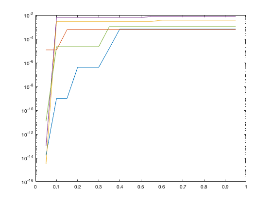
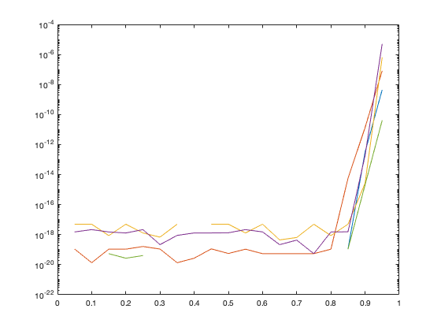

## Buildup of this web site

This site contains the MATLAB code from the Integrated design project of P.H.W. Hogendoorn. As well as the Simulink model used to simulate the reduced-order models and all data sets generated and used for validating the theoretical framework by Borja, Scherpen, and Fujimoto for extended balanced truncation.

### Matlab Models

Here all MATLAB models used for the integration project can be found

Main matlab code:
- [Main Matlab Model](https://github.com/PHW-H/IDP_extended_balanced_truncation/raw/main/RLC_system_Pancras_version.m)

Random model generator
- [Random Generator](https://github.com/PHW-H/IDP_extended_balanced_truncation/raw/main/Random_model_generator.m)

Port Hamiltonian model constructors:
- [Model type 1](https://github.com/PHW-H/IDP_extended_balanced_truncation/raw/main/Modeltype41.m)
- [Model type 2](https://github.com/PHW-H/IDP_extended_balanced_truncation/raw/main/Modeltype42.m)
- [Model type 3](https://github.com/PHW-H/IDP_extended_balanced_truncation/raw/main/Modeltype43.m)

### Simulink Model 

- [Simulink Model](balanced_modelreduction_rlc.slx)

### Used Models and results

simulated Models of type 1

| Model download | input | Reduction |  Model dimensions | Deviation from original General | Deviation from original extended | Simulink result |
| :---: | :---: | :---: | :--------------: | :--------------: | :-----: |
| [Model 1](https://github.com/PHW-H/IDP_extended_balanced_truncation/raw/main/Model_1.mat)| step 50 | 25% | C:20 L:20 | 1.6685e-7 | 0 | [Image](https://github.com/PHW-H/IDP_extended_balanced_truncation/raw/main/Model_1.png) |
| [Model 2](https://github.com/PHW-H/IDP_extended_balanced_truncation/raw/main/Model_2.mat)| step 50 | 25% | C:40 L:40 | 2.1235e-5 | 0 | [Image](https://github.com/PHW-H/IDP_extended_balanced_truncation/raw/main/Model_2.png) |
| [Model 3](https://github.com/PHW-H/IDP_extended_balanced_truncation/raw/main/Model_3.mat)| step 50 | 25% | C:60 L:60 | 2.1920e-5 | 5.4210e-20 | [Image](https://github.com/PHW-H/IDP_extended_balanced_truncation/raw/main/Model_3.png) |
| [Model 4](https://github.com/PHW-H/IDP_extended_balanced_truncation/raw/main/Model_4.mat)| sinusoidal | 25% | C:40 L:40 | 3.7724e-4 | 2.1684e-18 | [Image](https://github.com/PHW-H/IDP_extended_balanced_truncation/raw/main/Model_4.png) |
| [Model 5](https://github.com/PHW-H/IDP_extended_balanced_truncation/raw/main/Model_5.mat)| step 50 | 50% | C:20 L:20 | 4.3211e-4 | 5.7762e-13 | [Image](https://github.com/PHW-H/IDP_extended_balanced_truncation/raw/main/Model_5.png) |
| [Model 6](https://github.com/PHW-H/IDP_extended_balanced_truncation/raw/main/Model_6.mat)| step 50 | 50% | C:40 L:40 | 7.2875e-4 | 6.7763e-21 | [Image](https://github.com/PHW-H/IDP_extended_balanced_truncation/raw/main/Model_6.png) |
| [Model 7](https://github.com/PHW-H/IDP_extended_balanced_truncation/raw/main/Model_7.mat)| sinusoidal | 50% | C:40 L:40 | 2.1920e-5 | 1.0842e-19 | [Image](https://github.com/PHW-H/IDP_extended_balanced_truncation/raw/main/Model_7.png) |
| [Model 8](https://github.com/PHW-H/IDP_extended_balanced_truncation/raw/main/Model_8.mat)| sinusoidal | 25% | C:100 L:100 | 5.7047e-4 | 4.3368e-19 | [Image](https://github.com/PHW-H/IDP_extended_balanced_truncation/raw/main/Model_8.png) |

simulated Models of type 2

| Model download | input | Reduction |  Model dimensions | Deviation from original General | Deviation from original extended | Simulink result |
| :---: | :---: | :---: | :--------------: | :--------------: | :-----: |
| [Model 2_1](https://github.com/PHW-H/IDP_extended_balanced_truncation/raw/main/Model_2_1.mat)| step 50 | 25% | C:20 L:20 | 1.3611e-05 | 1.3553e-20 | [Image](https://github.com/PHW-H/IDP_extended_balanced_truncation/raw/main/Model_2_1.png) |
| [Model 2_2](https://github.com/PHW-H/IDP_extended_balanced_truncation/raw/main/Model_2_2.mat)| step 50 | 25% | C:40 L:40 | 6.4766e-04 | 1.7381e-18 | [Image](https://github.com/PHW-H/IDP_extended_balanced_truncation/raw/main/Model_2_2.png) |
| [Model 2_3](https://github.com/PHW-H/IDP_extended_balanced_truncation/raw/main/Model_2_3.mat)| step 50 | 25% | C:60 L:60 | 0.0016 | 6.7769e-21 | [Image](https://github.com/PHW-H/IDP_extended_balanced_truncation/raw/main/Model_2_3.png) |
| [Model 2_4](https://github.com/PHW-H/IDP_extended_balanced_truncation/raw/main/Model_2_4.mat)| sinusoidal | 25% | C:40 L:40 | 7.5052e-06 | 6.7761e-21 | [Image](https://github.com/PHW-H/IDP_extended_balanced_truncation/raw/main/Model_2_4.png) |
| [Model 2_5](https://github.com/PHW-H/IDP_extended_balanced_truncation/raw/main/Model_2_5.mat)| step 50 | 50% | C:20 L:20 | 2.1852e-05 | 5.5896e-13 | [Image](https://github.com/PHW-H/IDP_extended_balanced_truncation/raw/main/Model_2_5.png) |
| [Model 2_6](https://github.com/PHW-H/IDP_extended_balanced_truncation/raw/main/Model_2_6.mat)| step 50 | 50% | C:40 L:40 | 73.4352e-04 | 3.7188e-26 | [Image](https://github.com/PHW-H/IDP_extended_balanced_truncation/raw/main/Model_2_6.png) |
| [Model 2_7](https://github.com/PHW-H/IDP_extended_balanced_truncation/raw/main/Model_2_7.mat)| sinusoidal | 50% | C:40 L:40 | 0.0131 | 3.8790e-18 | [Image](https://github.com/PHW-H/IDP_extended_balanced_truncation/raw/main/Model_2_7.png) |
| [Model 2_8](https://github.com/PHW-H/IDP_extended_balanced_truncation/raw/main/Model_2_8.mat)| sinusoidal | 25% | C:100 L:100 | 3.0941e-04 | 3.4286e-19 | [Image](https://github.com/PHW-H/IDP_extended_balanced_truncation/raw/main/Model_2_8.png) |

simulated Models of type 3

| Model download | input | Reduction |  Model dimensions | Deviation from original General | Deviation from original extended | Simulink result |
| :---: | :---: | :---: | :--------------: | :--------------: | :-----: |
| [Model 3_1](https://github.com/PHW-H/IDP_extended_balanced_truncation/raw/main/Model_3_1.mat)| step 50 | 25% | C:20 L:20 | 3.9786 | 9.0366e-16 | [Image](https://github.com/PHW-H/IDP_extended_balanced_truncation/raw/main/Model_3_1.png) |
| [Model 3_2](https://github.com/PHW-H/IDP_extended_balanced_truncation/raw/main/Model_3_2.mat)| step 50 | 25% | C:40 L:40 | 0.3760 | 2.7756e-17 | [Image](https://github.com/PHW-H/IDP_extended_balanced_truncation/raw/main/Model_3_2.png) |
| [Model 3_3](https://github.com/PHW-H/IDP_extended_balanced_truncation/raw/main/Model_3_3.mat)| step 50 | 25% | C:60 L:60 | 0.1224 | 2.6646e-15 | [Image](https://github.com/PHW-H/IDP_extended_balanced_truncation/raw/main/Model_3_3.png) |
| [Model 3_4](https://github.com/PHW-H/IDP_extended_balanced_truncation/raw/main/Model_3_4.mat)| sinusoidal | 25% | C:40 L:40 | 0.0015 | 2.2276e-16 | [Image](https://github.com/PHW-H/IDP_extended_balanced_truncation/raw/main/Model_3_4.png) |
| [Model 3_5](https://github.com/PHW-H/IDP_extended_balanced_truncation/raw/main/Model_3_5.mat)| step 50 | 50% | C:20 L:20 | 4.9462 | 6.2172e-15 | [Image](https://github.com/PHW-H/IDP_extended_balanced_truncation/raw/main/Model_3_5.png) |
| [Model 3_6](https://github.com/PHW-H/IDP_extended_balanced_truncation/raw/main/Model_3_6.mat)| step 50 | 50% | C:40 L:40 | 0.0622 | 8.8818e-16 | [Image](https://github.com/PHW-H/IDP_extended_balanced_truncation/raw/main/Model_3_6.png) |
| [Model 3_7](https://github.com/PHW-H/IDP_extended_balanced_truncation/raw/main/Model_3_7.mat)| sinusoidal | 50% | C:40 L:40 | 27.9051 | 6.6169e-24 | [Image](https://github.com/PHW-H/IDP_extended_balanced_truncation/raw/main/Model_3_7.png) |
| [Model 3_8](https://github.com/PHW-H/IDP_extended_balanced_truncation/raw/main/Model_3_8.mat)| sinusoidal | 25% | C:100 L:100 | 0.0217 | 8.8818e-16 | [Image](https://github.com/PHW-H/IDP_extended_balanced_truncation/raw/main/Model_3_8.png) |

### Error bound

To obtain a graphical representation of the difference in error bound 5 models were created and their error bound is plotted. The plot shows the Error bound at different reductions: (5%, 10%, 15%, 20%,25%, 30%,... till 95%) for after applying Generalised balanced truncation (Red) and Extended Balanced truncation (Blue). All model consists of 100 Capacitors and 100 Inductors.

The programme to create these models and plots can be downloaded here: [Graph_maker](https://github.com/PHW-H/IDP_extended_balanced_truncation/raw/main/plots_maken.m)

### error bound of Model type 1

The used model can be downloaded here:

| [Model 11](https://github.com/PHW-H/IDP_extended_balanced_truncation/raw/main/Model_11.mat) | [Model 12](https://github.com/PHW-H/IDP_extended_balanced_truncation/raw/main/Model_12.mat) | [Model 13](https://github.com/PHW-H/IDP_extended_balanced_truncation/raw/main/Model_13.mat) | [Model 14](https://github.com/PHW-H/IDP_extended_balanced_truncation/raw/main/Model_14.mat) | [Model 15](https://github.com/PHW-H/IDP_extended_balanced_truncation/raw/main/Model_15.mat) |

error generalised balanced:

error extended balanced:

### Model 2

The model used for creating this graph can be downloaded here:

| [Model 21](https://github.com/PHW-H/IDP_extended_balanced_truncation/raw/main/Model_21.mat) | [Model 22](https://github.com/PHW-H/IDP_extended_balanced_truncation/raw/main/Model_22.mat) | [Model 23](https://github.com/PHW-H/IDP_extended_balanced_truncation/raw/main/Model_23.mat) | [Model 24](https://github.com/PHW-H/IDP_extended_balanced_truncation/raw/main/Model_24.mat) | [Model 25](https://github.com/PHW-H/IDP_extended_balanced_truncation/raw/main/Model_25.mat) |

### Model 3

The model used for creating this graph can be downloaded here:

| [Model 31](https://github.com/PHW-H/IDP_extended_balanced_truncation/raw/main/Model_31.mat) | [Model 32](https://github.com/PHW-H/IDP_extended_balanced_truncation/raw/main/Model_32.mat) | [Model 33](https://github.com/PHW-H/IDP_extended_balanced_truncation/raw/main/Model_33.mat) | [Model 34](https://github.com/PHW-H/IDP_extended_balanced_truncation/raw/main/Model_34.mat) | [Model 35](https://github.com/PHW-H/IDP_extended_balanced_truncation/raw/main/Model_35.mat) |

### The Paper can be downloaded here

[IDP by Pancras Hogendoorn](Reductionoflarge_scaleelectricalmodels (8).pdf)
